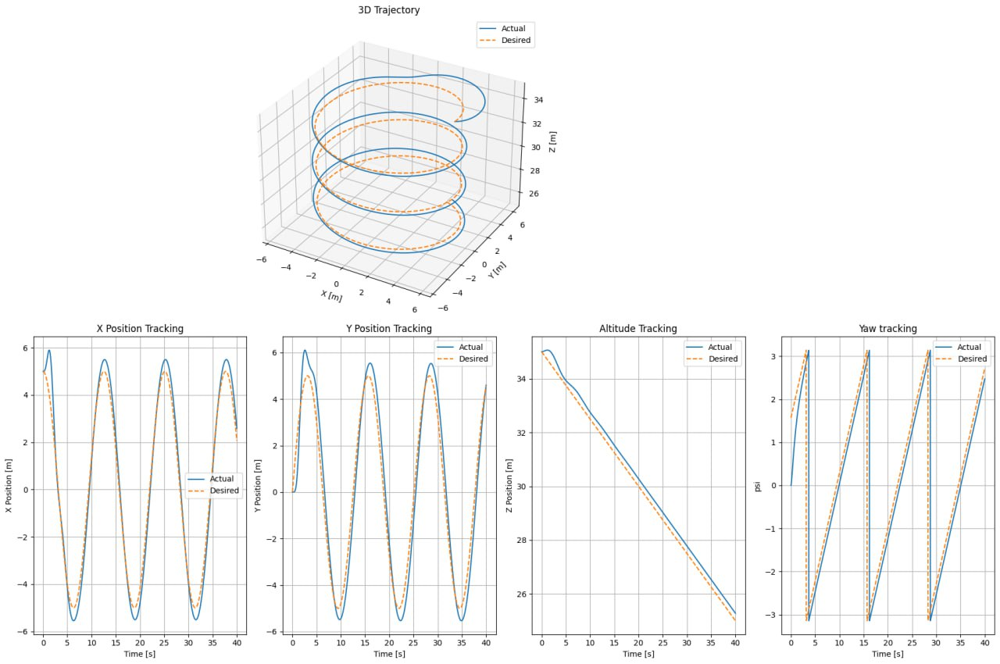

# Backstepping Control of Drone

## Introduction
Drones are widely used for monitoring, rescue, supervision, and as aerial base stations. In the military, they reduce human losses and provide precise monitoring and strikes. Backstepping control, based on Lyapunov stability, is robust to parametric variations and ensures system stability.

---

## Quadrotor Dynamic Modeling

### Quadrotor Configuration

## Dynamics

More exact mathematical equations are in [theory](theory.pdf). It was assumed thet our drone doesnt have any gyroscopic effects on flight so this part of real drone dynamics wasn't mentioned.

## State space

UAV is quite a complicated system with 6 degrees of freedom: 3 for positioning and 3 for orientation (roll, pitch, yaw)

so we made our state space vector of 12 variables: all DoFs and their first derivatives

$$
\mathbf{X} = 
\begin{bmatrix}
\phi \\ 
p \\ 
\theta \\ 
q \\ 
\psi \\ 
r \\ 
z \\ 
\dot{z} \\ 
y \\ 
\dot{y} \\ 
x \\ 
\dot{x}
\end{bmatrix}
\quad
\text{(State Vector)}
$$

## Control actions

From dynamics [theory](theory.pdf) we can get 4 control actions:

$$
\mathbf{U} = 
\begin{bmatrix}
U_1 \\ 
U_2 \\ 
U_3 \\ 
U_4
\end{bmatrix}
\quad
$$

where $U_1$ - thrust and $U_2$, $U_3$, $U_4$ are torques to control orientation angles.

From the Lyapunov functions the controls was derived:

$U_1 = m / (\cos x_7 \cos x_9) * ( g + \ddot{x}_5^d + z_5 + k_5 \dot{z}_5 - k_6 z_6 - h_z / m )$

$U_2 = (J_x / l) * ( -f_4 + \ddot{x}_7^d + z_7 + k_7 \dot{z}_7 - k_8 z_8 - (h_\phi / J_x) )$

$U_3 = (J_y / l) * ( -f_5 + \ddot{x}_9^d + z_9 + k_9 \dot{z}_9 - k_{\{10\}} z_{\{10\}} - (h_\theta / J_y) )$

$U_4 = J_z * ( -f_6 + \ddot{x}_{\{11\}}^d + z_{\{11\}} + k_{\{11\}} \dot{z}_{\{11\}} - k_{\{12\}} z_{\{12\}} - (h_\psi / J_z) )$

$U_x = m / U_1 * ( \ddot{x}_1^d + z_1 + k_1 \dot{z}_1 - k_2 z_2 - h_x / m )$

$U_y = m / U_1 * ( \ddot{x}_3^d + z_3 + k_3 \dot{z}_3 - k_4 z_4 - h_y / m )$

## Desired trajectory

To build the control we need reference trajectory to track it. This trajectory can be different but we need some exact variable to wake controller work:

$$
\mathbf{X}_{\text{des}} = 
\begin{bmatrix}
\psi_d \\ 
z_d \\ 
y_d \\ 
x_d
\end{bmatrix}
\quad
$$

so we need position trajectory and yaw (for example to make photoes of the puilding we can use spiral trajectory and make yaw agle that will make drone to 'see' the axis of spiral)

## Backstepping algorithm
We compute error of real ad desired state variables separatelly. In each timestep we compute main or temporal control action and get wariables for further simulation. more exactly in [theory](theory.pdf)

## Simulation Results

